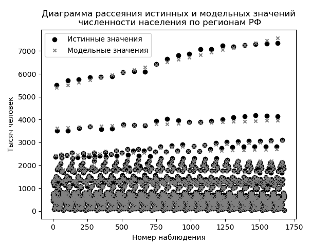
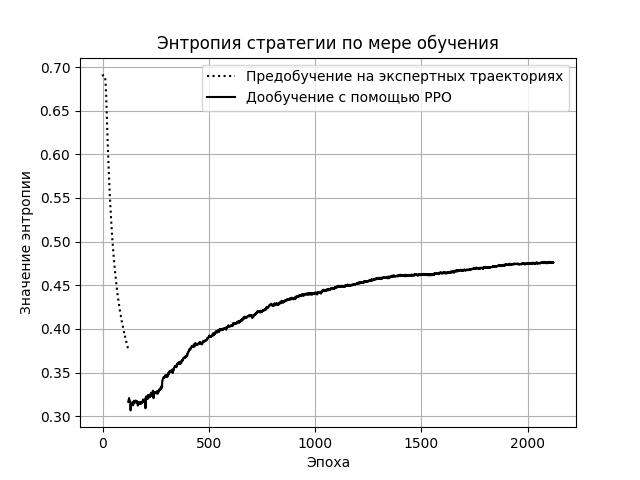
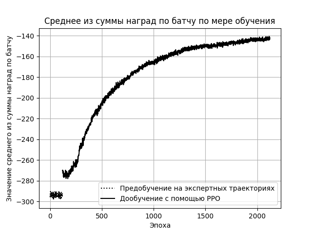
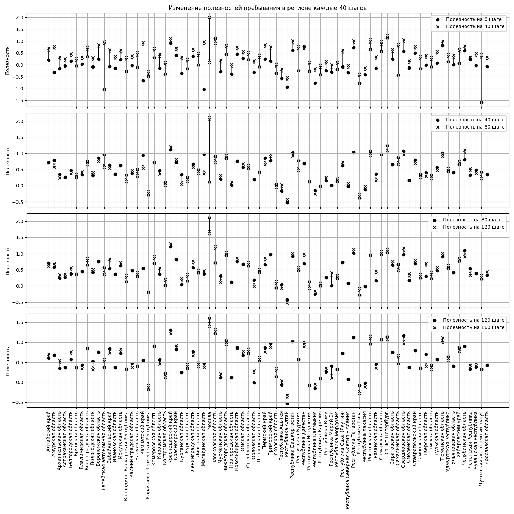

# Таргетирование внутренней миграции рабочей силы в Российской Федерации с помощью обучения с подкреплением

## Цель работы

Цель заключается в обучении стратегии инвестирования в регионы Российской Федерации для таргетирования распределения численности рабочей силы по регионам. Работа состоит из двух смысловых блоков. Первый заключается в оценке миграционной привлекательности регионов. Второй заключается в поиске стратегии, превосходящей тривиальный алгоритм по скорости достижения целевого состояния.

## Статистика 

Статистические оценки текущей агрегированной полезности пребывания в регионе были получены с помощью фреймворка `pymc`. Весь код содежится в `bayes.ipynb`. Для его запуска потребуется установка `pymc`. К сожалению, при установке с помощью `pip` могут наблюдаться проблемы, рекомендуется использовать `conda`. Необходимые библиотеки указаны в `conda-requirements.txt`.

### Результат моделирования

## Обучение

Если есть желание обучить модель с нуля, необходимо открыть файл `learn.ipynb` как блокнот jupyter notebook, далее запустить все ячейки. Параметры модуля `PPO` отвечают за: логирование в `tensorboard`; происходит предобучение или нет; используется усложненное сэмплирование с концентрацией, обладающей более высокой дисперсией; шаг обучения; размер батча, сид. Результаты обучения можно увидеть по логам в `tensorboard` в директории `runs`. Сид был установлен на уровне 42.

## Инференс

Оценить результаты обучения можно с помощью блокнота jupyter notebook `inference.ipynb`. 

Стоит отметить, что в этой работе не предлагается нейронная сеть для достижения любого целевого состояния. Так, цели при обучении генерировались с помощью распределения Дирихле с концентрацией на уровне единицы. Это повлияло на то, что теперь при указании в качестве цели распределения рабочей силы по регионам, в рамках которого у одного из регионов доля рабочей силы более 12%, алгоритм к ней может не прийти.

Пример осуществления стратегии для достижение некоторого целевого состояния, в котором предлагается сократить долю населения в Москве на 4, в Московской области - на 2, в Санкт-Петербурге - на 1 п.п., увеличив население на столько же пунктов в сумме равномерно в следующих регионах: Республика Бурятия, Республика Саха (Якутия), Забайкальский край, Камчатский край, Приморский край, Хабаровский край, Амурская область, Магаданская область, Сахалинская область, Чукотский автономный округ, Еврейская автономная область. Нейронная сеть пришла к такому распределению долей за 86 шагов. Рассмотрим, каким образом:

